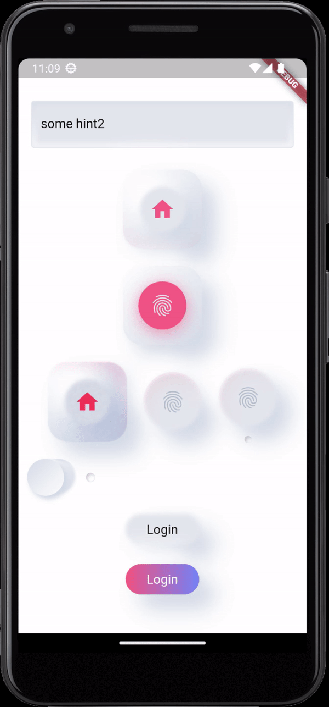

# ITWiLLROCK Neumorphism

This project showcases an advanced implementation of Neumorphic design. Contributions are welcome. For assistance with integrating this UI into your project, please contact the author at contact@itwillrock.com.

## Table of Contents

- [Features](#features)
- [Installation](#installation)
- [Usage](#usage)
- [Demo](#demo)
- [Accents](#accents)
- [Examples](#examples)

## Features

This package allows you to easily create UI based on the Neumorphism design language. Currently, the following controls are supported:
1. Generic Container
2. RoundButton (button with or without accent support)
3. AccentList (list-like widget)
4. Indicator Button
5. Checkbox
6. TextInputs
7. Counter

More to come.

## Installation

Add the package to your project by including it in your `pubspec.yaml` file:

```yaml
dependencies:
  itwillrock_neumorphism: ^0.0.36
```

Then, run `flutter pub get` to install the package.

## Usage

Import the package in your Dart code:

```dart
import 'package:itwillrock_neumorphism/neumorphism.dart';
```

## Demo



Note that there is a highlight of the surrounded controls to indicate the change in the main control.

## Accents

Controls in this package can have a global accent color highlight. This is achieved by setting the `accentAlignment`, `renderAccent`, and other related properties. For example:

```dart
Neumorphism.container(
  dropInnerShadow: false,
  margin: const EdgeInsets.all(10),
  padding: const EdgeInsets.all(10),
  accentAlignment: const Alignment(1, 0),
  renderAccent: true,
  accentIntensity: 1.0,
  child: Container(
    child: Neumorphism.softRoundButton(
      size: const Size(60, 60),
      toggle: true,
      shape: RoundedRectangleBorder(
        borderRadius: BorderRadius.circular(30),
      ),
      margin: const EdgeInsets.all(10),
      icon: Icon(
        Icons.home,
        color: AppColors.accentColor,
        size: 32,
      ),
    ),
  ),
);
```

### Accent Button

```dart
Neumorphism.accentButton(
  size: const Size(60, 60),
  toggle: false,
  shape: RoundedRectangleBorder(
    borderRadius: BorderRadius.circular(30),
  ),
  margin: const EdgeInsets.all(10),
  accentChanged: (intensity) {
    setState(() {
      intensity1 = intensity;
    });
  },
  child: Icon(
    Icons.fingerprint,
    color: AppColors.mainColor,
    size: 32,
  ),
);
```

### Indicator Button with Accent

```dart
Neumorphism.indicatorButton(
  accentAlignment: const Alignment(1, -1),
  accentColor: AppColors.accentColor,
  accentIntensity: 0.5,
  size: 74,
  shape: RoundedRectangleBorder(
    borderRadius: BorderRadius.circular(37),
  ),
  margin: const EdgeInsets.all(10),
  icon: const Icon(
    Icons.fingerprint,
    color: Color(0xFFADBAC7),
    size: 32,
  ),
);
```

## Examples

### AccentList Sample

```dart
Expanded(
  child: Neumorphism.accentList(
    margin: const EdgeInsets.all(10),
    padding: const EdgeInsets.all(10),
    items: [
      "List 1",
      "List 2",
      "...",
    ],
  ),
);
```

### Frosted Glass Container

```dart
Neumorphism.frostedGlassContainer(
  margin: const EdgeInsets.all(10),
  padding: const EdgeInsets.all(10),
  dropShadow: true,
  dropInnerShadow: true,
  child: SizedBox(
    height: 200,
  ),
);
```

### Email Form Field

```dart
Neumorphism.emailFormField(
  hint: 'Enter your email',
);
```

### Soft Round Button

```dart
Neumorphism.softRoundButton(
  size: const Size(60, 60),
  toggle: true,
  shape: RoundedRectangleBorder(
    borderRadius: BorderRadius.circular(30),
  ),
  margin: const EdgeInsets.all(10),
  icon: Icon(
    Icons.home,
    color: AppColors.accentColor,
    size: 32,
  ),
);
```

### Soft Round Button with Text

```dart
Neumorphism.softRoundButton(
  margin: const EdgeInsets.all(10),
  padding: const EdgeInsets.all(0),
  size: const Size(96, 42),
  text: "Login",
);
```

### Animated Soft Round Button

```dart
Neumorphism.softRoundButton(
  main: true,
  margin: const EdgeInsets.all(10),
  padding: const EdgeInsets.all(0),
  size: const Size(96, 42),
  onTap: () {
    if (_animationController.status == AnimationStatus.completed) {
      _animationController.reverse();
    } else {
      _animationController.forward();
    }
  },
  text: "Login",
);
```

### Text and Icons

```dart
// Simple text with default styling
Neumorphism.text("Hello World");

// Gradient text effect
Neumorphism.gradientText("Gradient Title");

// Neumorphic icon
Neumorphism.icon(Icons.favorite, size: 32);

// Flexible text that wraps
Neumorphism.wrappingText("This is a long text that will wrap to the next line if needed", 
  size: 18,
  fontWeight: FontWeight.bold
);
```

### Form Elements

```dart
// Email field with validation
Neumorphism.emailFormField(
  hint: 'Enter your email',
);

// Password field
Neumorphism.passwordFormField(
  label: 'Password',
  renderAccent: true,
  accentAlignment: Alignment(0, 1),
  accentIntensity: 0.5,
);

// Dropdown form field
Neumorphism.dropDownFormField<String>(
  value: selectedValue,
  items: ['Option 1', 'Option 2', 'Option 3'],
  onChanged: (value) {
    setState(() {
      selectedValue = value;
    });
  },
);

// Custom text form field
Neumorphism.textFormField(
  label: 'Custom Input',
  icon: Neumorphism.icon(Icons.description),
  renderAccent: true,
);

// Counter
Neumorphism.counter(
  initialValue: 1,
  onChanged: (value) {
    setState(() {
      count = value;
    });
  },
);

// Checkbox
Neumorphism.checkBox(
  onChanged: (value) {
    setState(() {
      isChecked = value;
    });
  },
);
```

### Containers and Buttons

```dart
// Basic container
Neumorphism.container(
  child: Text('Basic container'),
  dropShadow: true,
  dropInnerShadow: false,
);

// Action container
Neumorphism.actionContainer(
  onTap: () => print('Tapped!'),
  child: Neumorphism.text("Tap me"),
  size: const Size(200, 48),
  renderAccent: true,
  accentIntensity: 0.5,
);

// Extended action container
Neumorphism.extendedActionContainer(
  child: Neumorphism.text("Extended Action"),
  onTap: () => print('Extended action'),
  size: const Size(250, 60),
  main: true,
);

// Soft round button
Neumorphism.softRoundButton(
  size: const Size(96, 42),
  text: "Login",
);

// Soft round button with icon
Neumorphism.softRoundButton(
  size: const Size(60, 60),
  toggle: true,
  icon: Neumorphism.icon(Icons.home, color: AppColors.accentColor),
);

// Animated soft round button
Neumorphism.softRoundButton(
  margin: const EdgeInsets.all(10),
  padding: const EdgeInsets.all(0),
  size: const Size(96, 42),
  onTap: () {
    if (_animationController.status == AnimationStatus.completed) {
      _animationController.reverse();
    } else {
      _animationController.forward();
    }
  },
  text: "Login",
);

// Indicator button 
Neumorphism.indicatorButton(
  accentAlignment: const Alignment(1, -1),
  accentColor: AppColors.accentColor,
  accentIntensity: 0.5,
  size: 74,
  icon: Neumorphism.icon(Icons.fingerprint),
);

// Back button
Neumorphism.backButton(
  onTap: () => Navigator.pop(context),
);

// Menu button
Neumorphism.menuButton(
  animationStep: 0.5, // 0 for hamburger, 1 for X
);

// Image with neumorphic styling
Neumorphism.image(
  'https://example.com/image.jpg',
  width: 200,
  height: 150,
);
```

### Charts and Lists

```dart
// Accent list
Neumorphism.accentList(
  margin: const EdgeInsets.all(10),
  padding: const EdgeInsets.all(10),
  items: ["Item 1", "Item 2", "Item 3"],
  onItemSelected: (item) => print('Selected: $item'),
);

// Series chart
Neumorphism.seriesChart(
  valueNotifier,
  padding: const EdgeInsets.all(16),
);

// Series types chart
Neumorphism.seriesTypesChart(
  color: AppColors.accentColor,
  onItemSelected: (type) => print('Selected type: $type'),
);
```

### Frosted Glass Container

```dart
Neumorphism.frostedGlassContainer(
  margin: const EdgeInsets.all(10),
  padding: const EdgeInsets.all(10),
  dropShadow: true,
  dropInnerShadow: true,
  child: SizedBox(
    height: 200,
    child: Center(child: Neumorphism.text('Frosted glass effect')),
  ),
);
```