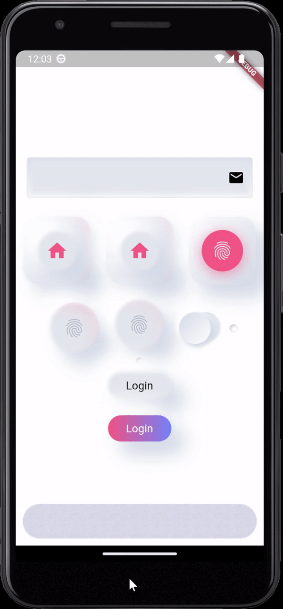

This is an advance Neumorphic design implementation. Feel free to contribute. 
## Features

This packahe allows you to easily create UI based on Neumorphism design language. 
Currently next controls supported: 
1. Generic Container
2. RoundButton (basically the button with or without accent support)
3. AccentList (list like Widget)
4. Indicator Button
5. Checkbox
6. TextInputs
7. Counter

more to come. 

## Usage

Just add it to your project by adding it to dependencies. 

```dart
dependencies:
  itwillrock_mobile_ui:
```

## Demo



Note that there is a highlight of the surrounded controls to indicate the change in the main control. 